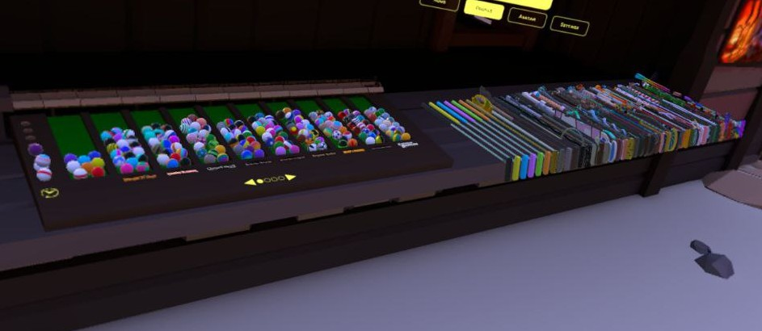
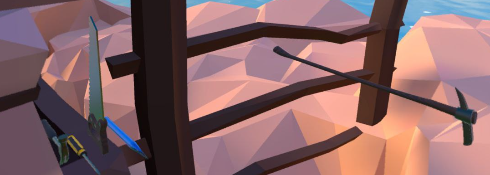

# 🏌️ Walkabout Mini Golf: Balls & Putters Unlocker (WEBAPP) by [K1TTYBLACK](https://horizon.meta.com/profile/112795680903761/)

This application unlocks all balls and putters in **Walkabout Mini Golf** *(any platform)*.
- Video tutorial: https://www.youtube.com/watch?v=DVl7t_ED4pg

## ⚠️ UPDATED
- There 5 extra putters that I haven't noticed before: screwdriver, hammer, pencil, saw and picaxe. You can find them near logs to the right side of main menu

## ⚠️ Warning

- **Hunting for balls and clues is more enjoyable and rewarding than using this app.**
- **This app can unlock secret putters.** No need to use this app again after game update. Everything new should be unlocked.
- Tested on game version 5.6 (build 37174) for Meta Quest Standalone
- Ensure to backup your data
- Use at your own risk. This application may violate game's terms of service. This project is for educational purposes only.

## 🎮 Usage
1. Quit game if open
2. **IMPORTANT: Disable internet on your device.**
3. **Copy and Backup your game data folder!**
   - **Android/Quest:** `Android/data/com.MightyCoconut.WalkaboutMiniGolf`
   - **Steam/Quest Link:** `%USERPROFILE%\AppData\LocalLow\Mighty Coconut\Walkabout Mini Golf`
   - **iOS:** `no idea, find yourself`
4. In copied folder copy `files/Profiles/Oculus/XXXXXXXXXXXXX/Player_XXXXXXX.data` to a destination you prefer. Path may be different depending on what device game is installed. This example is for Meta Quest Standalone
5. Go to **WMG: BP** 
6. Import 'Player_XXXXXXX.data' into the program. You will see your profile's username.
7. Click on "Unlock Putters" and/or "Unlock Balls". The program will **backup original file** and create a **modified one** under the **same name**.
8. Replace modified file to destination **where you got original file from**. Do not create any copies inside this destination - just replace original one.
9. Run the game and verify that everything is unlocked.
10. **Enable internet while in-game and try joining a multiplayer match.**
11. **Restart the game to ensure that progress is saved on MightyCoconut servers**

## 📚 License
This project is licensed under a **Creative Commons Attribution-NonCommercial-NoDerivatives 4.0 International (CC BY-NC-ND 4.0)** license.

- **No Commercial Use:** You may not use the material for commercial purposes.
- **No Derivatives:** If you remix, transform, or build upon the material, you may not distribute the modified version.
- **Attribution Required:** You must give appropriate credit.

For more details, see [Creative Commons License](https://creativecommons.org/licenses/by-nc-nd/4.0/).

